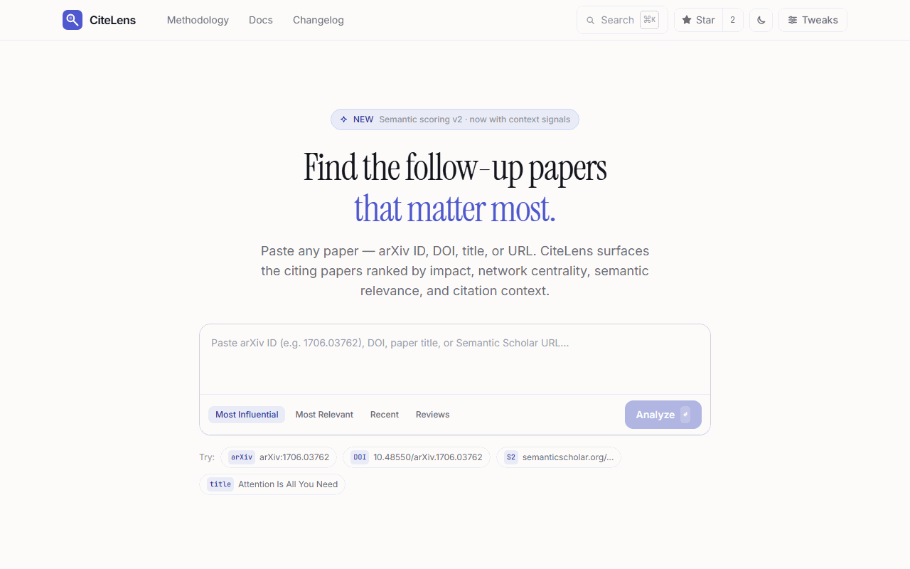

<div align="center">

# CiteLens

**Discover the papers that actually matter — ranked by impact, not just count.**

Paste any paper link. Get a scored, explainable list of the most important papers citing it.

[](https://kishormorol.github.io/CiteLens/)
[](LICENSE)
[](https://fastapi.tiangolo.com)
[](https://react.dev)

<br/>



</div>

---

## The problem

A landmark paper gets cited by hundreds of follow-ups. Reading them all is impossible. Sorting by citation count alone ignores relevance, recency, and how the work was actually used. You end up either reading too much or missing what matters.

## What CiteLens does

CiteLens gives every citing paper a **multi-signal score** and tells you *why* it ranked there.

```
Input:  1706.03762  (or any arXiv ID, DOI, title, or Semantic Scholar URL)

Output: Ranked list of citing papers, each scored across four dimensions:
        Impact · Network · Relevance · Context
        with a plain-English explanation for each result.
```

👉 **[Try it live — no sign-up, no API key needed](https://kishormorol.github.io/CiteLens/)**

---

## How scores work

| Signal | Weight | What it measures |
|---|---|---|
| **Impact** | 45% | Field-normalized citation percentile + FWCI (via OpenAlex) |
| **Network** | 25% | Local PageRank across the full candidate citation graph |
| **Relevance** | 20% | Semantic similarity to the seed paper (title + abstract) |
| **Context** | 10% | Semantic Scholar "highly influential" citation flag |

```
FinalScore = 0.45 × Impact + 0.25 × Network + 0.20 × Relevance + 0.10 × Context
```

Weights are renormalized when a signal is missing. Every result shows the full breakdown.

---

## Features

- **Any input format** — arXiv ID/URL, DOI, DOI URL, Semantic Scholar URL, or plain title
- **Ranked results** — sorted by weighted multi-signal score, not raw citation count
- **Per-paper explanations** — plain-English "Why ranked here" for every result
- **Smart filters** — year range, minimum relevance score, influential-only, reviews-only
- **Timeline view** — visualize how citation activity has grown year by year
- **Network graph** — force-directed citation graph; nodes animate outward from seed on load; node size = citations, color = score tier, distance from seed ≈ relevance; drag to reposition, hover to preview, click to inspect score breakdown
- **Four sort modes** — Most Influential, Most Relevant, Recent, Reviews
- **Dark mode** — full token-driven palette, five accent colors, compact/cozy density
- **Zero config** — works out of the box in demo mode with no API keys
- **Open data** — powered by Semantic Scholar, OpenAlex, and arXiv (all free APIs)

---

## Data sources

| Source | Role |
|---|---|
| [Semantic Scholar](https://api.semanticscholar.org/) | Primary paper lookup + citation graph |
| [OpenAlex](https://openalex.org/) | FWCI, citation percentile, citing paper enrichment |
| [arXiv](https://arxiv.org/help/api) | Metadata fallback for arXiv papers |

All three APIs are free and open. CiteLens requires no paid subscriptions.

---

## Stack

```
Frontend          React 18 + TypeScript + Vite + Tailwind CSS
Backend           FastAPI + Python 3.11 + Pydantic v2
Deployment        GitHub Pages (frontend) + Railway (backend)
CI/CD             GitHub Actions — build, test, deploy on push to main
```

---

## Quick start

### Run locally (5 minutes)

**1. Clone**
```bash
git clone https://github.com/kishormorol/CiteLens.git
cd CiteLens
```

**2. Frontend**
```bash
npm install
npm run dev
# → http://localhost:5173/CiteLens/
```

Opens immediately with bundled demo data — no backend needed.

**3. Backend** *(optional — for real results)*
```bash
cd backend
pip install -r requirements-dev.txt
cp .env.example .env
# set OPENALEX_EMAIL in .env (free, just your email)
uvicorn app.main:app --reload --port 8000
# → http://localhost:8000/docs
```

Then set `VITE_API_BASE_URL=http://localhost:8000` in a root `.env` and restart the frontend.

### Run tests
```bash
cd backend
pytest tests/ -v   # 42 tests, no API keys required
```

---

## Deploy your own

### Backend → Railway (recommended)

1. Fork this repo
2. [railway.app](https://railway.app) → **New Project → Deploy from GitHub repo**
3. **Settings → Root Directory**: `backend`
4. **Variables** tab → add:

| Variable | Value |
|---|---|
| `APP_ENV` | `production` |
| `ALLOWED_ORIGINS` | `https://<your-username>.github.io` |
| `OPENALEX_EMAIL` | your@email.com |
| `SEMANTIC_SCHOLAR_API_KEY` | *(optional — raises rate limit 1→10 req/s)* |

5. Copy the public Railway URL

### Backend → Render

1. **New Web Service** → connect repo → **Root Directory**: `backend`
2. **Build**: `pip install -r requirements.txt`
3. **Start**: `uvicorn app.main:app --host 0.0.0.0 --port $PORT`
4. Add the same environment variables as above
5. Health check path: `/health`

### Frontend → GitHub Pages

1. **Settings → Pages → Source**: Deploy from `gh-pages` branch
2. **Settings → Secrets → Actions → New secret**:
   - Name: `VITE_API_BASE_URL`
   - Value: your Railway/Render URL
3. Push to `main` — GitHub Actions builds and deploys automatically

---

## API reference

### `POST /api/analyze-paper`

```bash
curl -X POST https://citelens-api-production.up.railway.app/api/analyze-paper \
  -H "Content-Type: application/json" \
  -d '{"query": "1706.03762", "limit": 20}'
```

`query` accepts: arXiv ID · arXiv URL · DOI · DOI URL · Semantic Scholar URL · paper title

<details>
<summary>Example response</summary>

```json
{
  "seedPaper": {
    "id": "204e3073870fae3d05bcbc2f6a8e263d9b72e776",
    "title": "Attention Is All You Need",
    "authors": ["Ashish Vaswani", "Noam Shazeer", "..."],
    "citationCount": 142318,
    "year": 2017
  },
  "summary": {
    "totalCitingPapers": 1284,
    "rankedCandidates": 20,
    "sourcesUsed": ["semantic_scholar", "openalex"],
    "mockMode": false
  },
  "results": [
    {
      "title": "BERT: Pre-training of Deep Bidirectional Transformers...",
      "finalScore": 0.96,
      "impactScore": 0.97,
      "networkScore": 0.95,
      "relevanceScore": 0.91,
      "citationIntentScore": 1.0,
      "highlyInfluential": true,
      "badges": ["Highly Influential", "High Impact"],
      "whyRanked": "Top-cited citing paper. FWCI 145.2×. Flagged as highly influential.",
      "breakdown": {
        "impact": "Top 0% cited in field. FWCI 145.2×.",
        "network": "Central node in local citation graph.",
        "relevance": "Strong topical overlap with seed.",
        "context": "Flagged as highly influential by Semantic Scholar."
      }
    }
  ]
}
```
</details>

Other endpoints: `POST /api/resolve-paper` · `POST /api/citations` · `GET /health`

---

## Environment variables

### Backend (`backend/.env`)

| Variable | Default | Description |
|---|---|---|
| `APP_ENV` | `development` | `development` or `production` |
| `USE_MOCK_DATA` | `false` | Skip all API calls, return bundled demo data |
| `FALLBACK_TO_MOCK_ON_ERROR` | `true` | Graceful fallback when upstream APIs fail |
| `SEMANTIC_SCHOLAR_API_KEY` | — | Optional. Raises SS rate limit from 1 to 10 req/s |
| `OPENALEX_EMAIL` | — | Recommended. Enables OA polite pool (faster + stable) |
| `ALLOWED_ORIGINS` | `http://localhost:5173,...` | Comma-separated CORS allow-list |

### Frontend (`.env`)

```env
VITE_API_BASE_URL=http://localhost:8000
```

---

## Project structure

```
CiteLens/
├── src/                        # React + TypeScript frontend
│   ├── components/             # UI — Hero, Filters, Results, Network, Timeline, Modals
│   ├── context/AppContext.tsx  # Global state (useReducer + AbortController)
│   ├── hooks/usePapers.ts      # Memoized filter + sort
│   ├── services/api.ts         # Backend client with demo fallback
│   └── data/mockData.ts        # Bundled demo data
├── backend/
│   └── app/
│       ├── routes/             # FastAPI endpoints
│       ├── services/           # Input parsing, paper resolver, ranking, enrichment
│       ├── models/             # Pydantic request/response models
│       └── utils/              # Text similarity, graph scoring, exceptions
├── .github/workflows/          # CI + GitHub Pages deploy
└── railway.toml                # Railway health check config
```

---

## Roadmap

- [x] Four-signal ranking (Impact, Network, Relevance, Context)
- [x] Per-paper explainability — plain-English score breakdown
- [x] Timeline view — citation arc over time
- [x] Network graph — force-directed graph with physics simulation, drag, hover dim, click panel
- [x] Dark mode, five accent themes, density modes
- [x] Full frontend ↔ backend integration
- [x] React error boundary + input validation
- [ ] Semantic embeddings (SPECTER2) for higher-quality relevance
- [ ] Citation context snippets — *how* a paper was cited, not just that it was
- [ ] Export to BibTeX / CSV
- [ ] Email alerts for new influential citations
- [ ] Per-IP rate limiting + result caching

---

## Star history

If CiteLens saves you time, **[give it a star ⭐](https://github.com/kishormorol/CiteLens)** — it helps other researchers find it and costs you one click.

---

## Contributing

Issues, ideas, and PRs are welcome.

1. Fork → create a branch → make your change
2. `pytest tests/ -v` must pass
3. Open a PR with a clear description

---

## License

MIT — free to use, fork, and deploy.

---

<div align="center">

Inspired by [scite.ai](https://scite.ai) · [Connected Papers](https://www.connectedpapers.com) · [ResearchRabbit](https://www.researchrabbit.ai)

**If CiteLens saved you time, consider starring the repo. It takes one second and helps researchers find this tool.**

</div>
